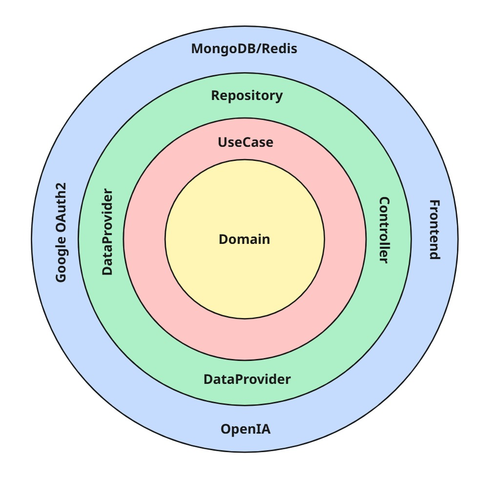

# Cotalizer – API Backend

---

> Backend REST do Cotalizer: geração/gestão de orçamentos (com e sem IA), PDFs em S3, autenticação e gestão de usuários.
> 
---

## Visão Geral

API responsável pelas principais regras de negócio:

- Geração e gerenciamento de orçamentos (com IA e tradicional)
- Geração de PDF e armazenamento em S3
- Gestão de usuários
- Autenticação (JWT e OAuth2/Google)

---

## Arquitetura & Domínio

### Estilo arquitetural

- **Clean Architecture** (camadas: EntryPoint → Application → Infrastructure → Domain). O diagrama de camadas está no repositório (veja `docs/arquitetura.png`).

**EntryPoint**

- Controllers, DTOs, mappers e middleware de erro.

**Application**

- Use cases, gateways (ports), exceções de aplicação.

**Infrastructure**

- Data providers (integrações externas como S3/Email/IA), mappers, repositories (MongoDB), security.

**Domain**

- Entidades/domínios puros (sem dependências de frameworks).

### Domínios principais

- **Avaliação**: feedback do usuário após orçamentos.
- **Orçamento (IA)** e **Orçamento Tradicional**
- **Plano**: limites e recursos por plano
- **Usuário**: cadastro, status, quotas mensais

> Dica visual rápida:
> 



---

## Infraestrutura

- **Hospedagem**: Render (SaaS) – disponibilidade diária.
- **Persistência**: MongoDB
- **Armazenamento**: AWS S3 (ou compatível)
- **Cache/Filas**: Redis (se aplicável)
- **Email**: SMTP (Spring Mail)
- **Autenticação**: JWT + OAuth2/Google (com cookies + CSRF no frontend)

---

## Tecnologias & Dependências

- **Linguagem/Framework**: Java 21, Spring Boot 3.5 (Web, Validation, Security, OAuth2 Client, Data MongoDB, Mail, Redis)
- **Auth**: Spring Security, JWT (jjwt-api/impl/jackson)
- **PDF**: OpenPDF / Flying Saucer (iText 2.1.7)
- **Cloud**: AWS SDK v2 (S3)
- **Testes**: JUnit 5, Mockito, Spring Security Test, JaCoCo
- **Outras**: Lombok, Jackson, Hibernate Validator, Commons Pool 2

> A lista completa está no pom.xml.
> 

---

## Como Rodar Localmente

**Pré-requisitos**

- Java 21
- Maven 3.9+
- MongoDB em execução (local ou container)
- (Opcional) MinIO/LocalStack para S3

**1) Subir dependências com Docker (exemplo)**

```yaml
# docker-compose.yml (exemplo)
version: "3.8"
services:
  mongo:
    image: mongo:7
    ports: ["27017:27017"]
  minio:
    image: minio/minio:latest
    command: server /data
    environment:
      MINIO_ACCESS_KEY: minio
      MINIO_SECRET_KEY: minio123
    ports: ["9000:9000","9001:9001"]

```

**2) Configurar .env/application.properties**

Aponte o S3 para o MinIO (endpoint override) ou use AWS real.

**3) Run**

```bash
mvn clean spring-boot:run

```

**4) Testes & cobertura**

```bash
mvn -q -DskipTests=false test
open target/site/jacoco/index.html

```

---

## Testes, Qualidade & Segurança

- **Testes**: JUnit 5 + Mockito; cobertura com JaCoCo.
- **Números atuais** (exemplo do último relatório):
    - Classes: 98.9%
    - Métodos: 93.4%
    - Linhas: 95.9%
    - **Branch**: 77.8%

**Autenticação e segurança**

- **JWT**: tokens de Access/Refresh; refresh via cookie HttpOnly, SameSite e `Secure` configurável.
- **OAuth2/Google**: login social como alternativa.
- **Segredos**: 100% via variáveis de ambiente/profiles (dev vs prod).

---

## Observabilidade

- **Logs estruturados** (SLF4J):
    - erros em *data providers* para falhas externas (S3, e-mail, etc.)
    - info nos principais *use cases* (Arquivo, Assinatura, Código de Validação, Login, Orcamento IA/Tradicional, Usuário, IA/Prompt).

---

## API & Contratos

- Integrações externas:
    - OpenAI (IA)
    - API de pagamentos do Cotalizer
    - Google (OAuth2)

**Padrão de resposta (exemplo)**

```json
{
  "dado": { /* payload */ },
  "erro": null
}

```

**Fluxos chave**

- `/auth/login` → define cookie de refresh + retorna access token
- `/auth/refresh` → rotaciona refresh e retorna novo access
- `/orcamentos` → CRUD e geração de PDF (S3)
---

## Licença / Uso

Este repositório é **proprietário** e destinado a uso interno do Cotalizer.

**Não** é liberado para uso, cópia, modificação ou distribuição por terceiros sem autorização expressa.

```
Copyright (c) 2025 Cotalizer.
Todos os direitos reservados.

```
